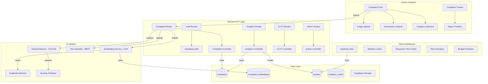
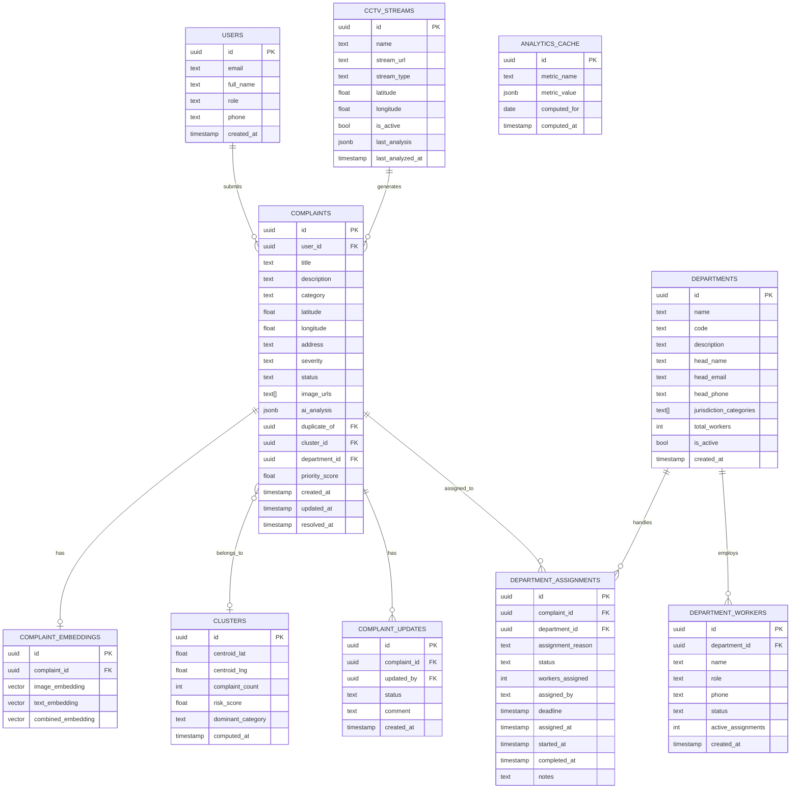

# CivicPulse — System Architecture Document

## 1. System Architecture Overview

CivicPulse follows a **3-tier architecture with an AI sidecar**:

```
┌─────────────────────────────────────────────────────────────┐
│                        FRONTEND                             │
│              React + TailwindCSS + Leaflet                  │
│              (Deployed on Vercel)                            │
└─────────────┬───────────────────────────────┬───────────────┘
              │ REST API calls                │ Direct DB (auth)
              ▼                               ▼
┌─────────────────────────┐     ┌─────────────────────────────┐
│     BACKEND (Node.js)   │     │        SUPABASE             │
│     Express REST API    │◄───►│  PostgreSQL + Auth + Storage│
│     (Deployed on Render)│     │  (Supabase Free Tier)       │
└─────────────┬───────────┘     └─────────────────────────────┘
              │ HTTP calls
              ▼
┌─────────────────────────┐
│    ML SERVICE (Python)  │
│    Flask + ONNX Runtime │
│    (Deployed on Render) │
└─────────────────────────┘
```

### Why This Architecture?

| Decision | Rationale |
|----------|-----------|
| **Separate ML service** | Python has better ML ecosystem; Node.js calls it via HTTP. Keeps Node backend lightweight. |
| **Supabase for auth** | Built-in JWT auth saves weeks of custom auth code. Row-level security for multi-tenancy. |
| **Supabase for storage** | S3-compatible blob storage for complaint images — no extra service needed. |
| **REST over GraphQL** | Simpler for MVP. Fewer abstractions. Easier to test and debug. |
| **ONNX Runtime over PyTorch** | 3-5x faster inference. No GPU needed. Fits in 512MB RAM on Render free tier. |
| **Leaflet over Google Maps** | Free, open-source. No API key billing surprises. |

---

## 2. Component Architecture



---

## 3. Data Flow Diagram

### 3.1 Complaint Submission Flow

```
Citizen                 Frontend             Backend            ML Service           Supabase
  │                        │                    │                    │                   │
  │── fill form ──────────►│                    │                    │                   │
  │── capture location ───►│                    │                    │                   │
  │── upload image ───────►│                    │                    │                   │
  │                        │── POST /complaints─►│                    │                   │
  │                        │                    │── upload image ────────────────────────►│
  │                        │                    │◄── image URL ──────────────────────────│
  │                        │                    │── POST /analyze ──►│                   │
  │                        │                    │                    │── hazard detect ──►│
  │                        │                    │                    │── classify text ──►│
  │                        │                    │                    │── generate embed ─►│
  │                        │                    │◄── AI results ────│                   │
  │                        │                    │── check duplicates─►│ (query embeddings)│
  │                        │                    │◄── dup results ───│                   │
  │                        │                    │── INSERT complaint─────────────────────►│
  │                        │                    │── INSERT embedding─────────────────────►│
  │                        │◄── complaint ID ──│                    │                   │
  │◄── confirmation ──────│                    │                    │                   │
```

### 3.2 CCTV Monitoring Flow

```
CCTV Stream          Backend (Cron)         ML Service            Supabase
    │                      │                     │                    │
    │── frame sample ─────►│                     │                    │
    │                      │── POST /detect ────►│                    │
    │                      │                     │── YOLOv8 infer ──►│
    │                      │◄── hazards[] ──────│                    │
    │                      │── auto-create complaint ───────────────►│
    │                      │── notify admin ────────────────────────►│
```

### 3.3 Analytics & Clustering Flow

```
Admin Request          Backend              ML Service            Supabase
    │                      │                     │                    │
    │── GET /analytics ───►│                     │                    │
    │                      │── query complaints──────────────────────►│
    │                      │◄── complaint data ─────────────────────│
    │                      │── run DBSCAN ──────►│                    │
    │                      │◄── clusters[] ─────│                    │
    │                      │── cache results ───────────────────────►│
    │◄── dashboard data ──│                     │                    │
```

---

## 4. Database Schema

### 4.1 Entity Relationship Diagram



### 4.2 Schema Design Rationale

| Table | Purpose |
|-------|---------|
| `complaints` | Core entity. Stores all citizen complaints with location, AI results, and administrative state. |
| `complaint_embeddings` | Separate table for high-dimensional vectors. Keeps `complaints` table fast for queries. |
| `clusters` | DBSCAN output. Precomputed clusters for heatmap rendering. Updated periodically. |
| `complaint_updates` | Audit trail. Every status change is logged with timestamp and actor. |
| `cctv_streams` | CCTV configuration. Stores stream URLs and latest analysis results. |
| `analytics_cache` | Precomputed metrics for dashboard. Avoids expensive real-time aggregations. |
| `departments` | Registry of city departments (Roads, Water, Electricity, Sanitation, etc.) with jurisdiction categories. |
| `department_assignments` | Links complaints to departments. Tracks worker count, status, deadlines, and completion. |
| `department_workers` | Individual workers per department. Tracks availability and active assignment load. |

---

## 5. AI Pipeline Design

### 5.1 Pipeline Overview

```
                    ┌──────────────────┐
                    │  Incoming Input   │
                    │ (image + text)    │
                    └────────┬─────────┘
                             │
              ┌──────────────┼──────────────┐
              ▼              ▼              ▼
    ┌─────────────┐ ┌──────────────┐ ┌────────────────┐
    │   YOLOv8    │ │    BERT      │ │     CLIP       │
    │  Hazard     │ │  Category +  │ │  Image + Text  │
    │  Detection  │ │  Severity    │ │  Embeddings    │
    └──────┬──────┘ └──────┬───────┘ └───────┬────────┘
           │               │                 │
           ▼               ▼                 ▼
    ┌─────────────┐ ┌──────────────┐ ┌────────────────┐
    │  Hazards    │ │  Category:   │ │  768-dim vector │
    │  Detected:  │ │  "road"      │ │  for duplicate  │
    │  pothole,   │ │  Severity:   │ │  detection      │
    │  crack      │ │  "high"      │ │  (cosine sim)   │
    └──────┬──────┘ └──────┬───────┘ └───────┬────────┘
           │               │                 │
           └───────────────┼─────────────────┘
                           ▼
                  ┌─────────────────┐
                  │ Combined Score  │
                  │ severity_score  │
                  │ = 0.4*hazard +  │
                  │   0.3*text +    │
                  │   0.3*density   │
                  └────────┬────────┘
                           ▼
                  ┌─────────────────┐
                  │ DEPT ROUTER     │
                  │ label → dept    │
                  │ auto-assign     │
                  └─────────────────┘
```

### 5.4 AI-Driven Department Routing

The system **automatically assigns complaints to the correct city department** using a deterministic mapping from AI outputs:

```
YOLOv8 Label / BERT Category  ──►  Department Mapping
─────────────────────────────────────────────────────
Damaged Road (0)               ──►  Roads & Infrastructure Dept
Pothole (1)                    ──►  Roads & Infrastructure Dept
Illegal Parking (2)            ──►  Traffic & Transport Dept
Broken Road Sign (3)           ──►  Traffic & Transport Dept
Fallen Trees (4)               ──►  Parks & Environment Dept
Littering/Garbage (5)          ──►  Sanitation & Waste Dept
Vandalism/Graffiti (6)         ──►  Law Enforcement / Municipal Dept
Dead Animal (7)                ──►  Animal Control / Sanitation Dept
Damaged Concrete (8)           ──►  Public Works & Buildings Dept
Damaged Elec. Wires (9)       ──►  Electricity & Power Dept
Water Supply Issues (text)     ──►  Water Supply & Drainage Dept
Sewage/Drain Issues (text)     ──►  Drainage & Sewerage Dept
```

**Routing Logic:**
1. YOLOv8 detects hazard label from image → primary department match
2. BERT classifies complaint text → secondary department match
3. If both agree → assign with HIGH confidence
4. If they disagree → use image-based label (more reliable for physical hazards)
5. If no image → fall back to text-based classification
6. Assignment creates a `department_assignments` record with auto-calculated deadline based on severity

**Tracking Features:**
- **Assignment Status**: `pending` → `acknowledged` → `in_progress` → `completed` / `escalated`
- **Worker Allocation**: Admin assigns N workers from the department's pool
- **Deadline Calculation**: Critical=24h, High=48h, Medium=5 days, Low=10 days
- **Performance Metrics**: Response time, resolution rate, overdue rate per department

### 5.2 Model Details

#### Hazard Detection (YOLOv8n — Ultralytics)
- **Input**: 640x640 RGB image
- **Output**: Bounding boxes with class labels (pothole, waterlogging, open_pit, missing_barrier, crack, debris)
- **Format**: ONNX (native export via Ultralytics `model.export(format='onnx')`)
- **Inference time**: ~40ms on CPU
- **Model size**: ~6MB (nano variant)
- **Why YOLOv8n**: Latest YOLO architecture with anchor-free detection, better mAP than v5, built-in ONNX export, actively maintained by Ultralytics

#### Text Classification (BERT-base-uncased)
- **Input**: Complaint text (max 256 tokens)
- **Output**: Category (road, water, sanitation, safety, electricity) + Severity (low, medium, high, critical)
- **Format**: ONNX via HuggingFace Optimum
- **Model size**: ~440MB ONNX
- **Why BERT-base**: Full transformer gives best classification accuracy; critical for a civic system where misclassification has real consequences

#### CLIP Embeddings
- **Input**: Image OR text
- **Output**: 512-dimensional embedding vector
- **Usage**: Generate embeddings for both image and text, concatenate for combined embedding
- **Duplicate detection**: Cosine similarity > 0.85 threshold flags potential duplicates

#### DBSCAN Clustering
- **Input**: Complaint coordinates (lat, lng)
- **Parameters**: eps=0.005 (~500m), min_samples=3
- **Output**: Cluster assignments, centroids, complaint counts
- **Runs**: Triggered on-demand or via scheduled job every 6 hours

### 5.3 Severity Scoring Formula

```
priority_score = (
    0.30 * hazard_severity_score +    # from YOLOv8 confidence
    0.25 * text_severity_score +       # from BERT
    0.20 * complaint_density_score +   # from cluster size
    0.15 * recency_score +             # newer = higher priority
    0.10 * population_impact_score     # from area population data
)
```

---

## 6. API Structure

### 6.1 Authentication
| Method | Endpoint | Purpose |
|--------|----------|---------|
| POST | `/api/auth/register` | Register citizen |
| POST | `/api/auth/login` | Login (returns JWT) |
| POST | `/api/auth/logout` | Invalidate session |
| GET | `/api/auth/me` | Get current user profile |

### 6.2 Complaints
| Method | Endpoint | Purpose |
|--------|----------|---------|
| POST | `/api/complaints` | Submit new complaint (with image) |
| GET | `/api/complaints` | List complaints (paginated, filterable) |
| GET | `/api/complaints/:id` | Get complaint details |
| PATCH | `/api/complaints/:id` | Update complaint status (admin) |
| GET | `/api/complaints/:id/duplicates` | Get duplicate suggestions |
| GET | `/api/complaints/nearby` | Get complaints within radius |

### 6.3 Analytics
| Method | Endpoint | Purpose |
|--------|----------|---------|
| GET | `/api/analytics/overview` | Dashboard stats (total, by category, by status) |
| GET | `/api/analytics/heatmap` | Cluster data for heatmap |
| GET | `/api/analytics/trends` | Time-series complaint trends |
| GET | `/api/analytics/response-times` | Average resolution times |
| GET | `/api/analytics/risk-areas` | High-risk area indicators |
| GET | `/api/analytics/duplicates` | Duplicate complaint insights |

### 6.4 CCTV
| Method | Endpoint | Purpose |
|--------|----------|---------|
| POST | `/api/cctv/streams` | Add CCTV stream (admin) |
| GET | `/api/cctv/streams` | List CCTV streams |
| POST | `/api/cctv/analyze` | Trigger frame analysis |
| GET | `/api/cctv/alerts` | Get recent hazard alerts |

### 6.5 Admin
| Method | Endpoint | Purpose |
|--------|----------|---------|
| GET | `/api/admin/priorities` | Budget-aware prioritized list |
| POST | `/api/admin/priorities/configure` | Set budget constraints |
| GET | `/api/admin/users` | List users |
| PATCH | `/api/admin/users/:id/role` | Change user role |

### 6.6 Departments
| Method | Endpoint | Purpose |
|--------|----------|---------|
| GET | `/api/departments` | List all departments |
| GET | `/api/departments/:id` | Department details + stats |
| GET | `/api/departments/:id/assignments` | All assignments for a department |
| GET | `/api/departments/:id/workers` | Workers in a department |
| POST | `/api/departments/:id/assignments` | Manually assign complaint (admin) |
| PATCH | `/api/departments/assignments/:id` | Update assignment status/workers |
| GET | `/api/departments/performance` | Department performance metrics |

### 6.7 ML (Internal — Python Flask)
| Method | Endpoint | Purpose |
|--------|----------|---------|
| POST | `/ml/analyze-image` | Run YOLOv8 hazard detection |
| POST | `/ml/classify-text` | Run BERT classification |
| POST | `/ml/embed` | Generate CLIP embeddings |
| POST | `/ml/detect-duplicates` | Check for duplicates |
| POST | `/ml/cluster` | Run DBSCAN clustering |
| GET | `/ml/health` | Health check |

---

## 7. Security Architecture

| Concern | Solution |
|---------|----------|
| Authentication | Supabase Auth (JWT-based) |
| Authorization | Role-based: `citizen`, `admin`. Backend middleware checks role. |
| API Protection | JWT verification on all protected routes |
| File Upload | Supabase Storage with size limits (5MB max per image) |
| Rate Limiting | Express rate limiter (100 req/min per IP) |
| Input Validation | Joi schema validation on all POST/PATCH endpoints |
| CORS | Whitelist frontend domain only |
| SQL Injection | Parameterized queries via Supabase client |

---

## 8. Free-Tier Resource Budget

| Resource | Limit | Expected Usage |
|----------|-------|---------------|
| Supabase DB | 500 MB | ~100MB (complaints, embeddings, clusters) |
| Supabase Storage | 1 GB | ~500MB (complaint images) |
| Supabase Auth | 50,000 MAU | <100 demo users |
| Render (Backend) | 512 MB RAM | Node.js: ~100MB |
| Render (ML) | 512 MB RAM | ONNX models: ~490MB total (BERT ~440MB + YOLOv8n ~6MB + CLIP lazy-loaded) |
| Vercel | 100 GB bandwidth | <1GB for demo |

> [!WARNING]
> Render free tier spins down after 15 min of inactivity. First request after sleep takes ~30 seconds. We handle this with a loading spinner in the frontend.
